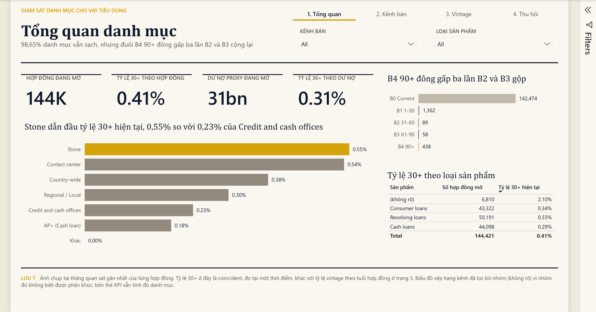
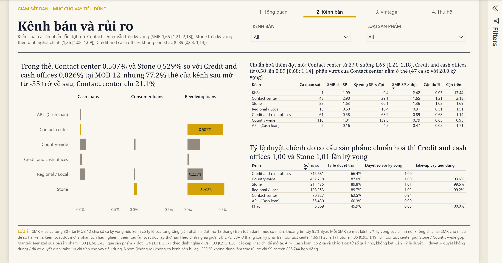
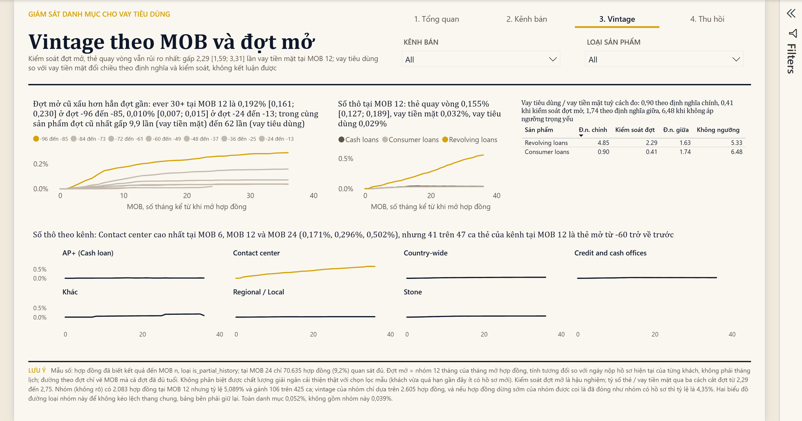
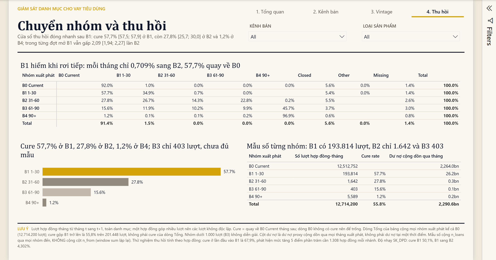

# Credit Portfolio Monitoring

Giám sát chất lượng danh mục cho vay tiêu dùng trên dữ liệu công khai **Home Credit Default Risk** (Kaggle): 1.040.632 hợp đồng, 13,73 triệu dòng hợp đồng-tháng, từ dữ liệu thô đến bộ chỉ tiêu có tài liệu, dashboard và memo đề xuất hành động.

**Stack:** Python, DuckDB, SQL (pipeline raw, stg, core, mart kèm 27 data test), Power BI dạng PBIP (Power BI Project: model TMDL, report PBIR, sinh bằng script), dashboard HTML/SVG tĩnh.

**Xem nhanh:** [Kết quả chính](#kết-quả-chính) · [Memo gửi lãnh đạo](docs/insight_memo.md) · [Phương pháp](docs/methodology.md) · [Dashboard trực tiếp](https://yq68.github.io/credit-portfolio-monitoring/dashboard/) · [Bản Power BI](powerbi/README.md)



**Xem dashboard trực tiếp:** https://yq68.github.io/credit-portfolio-monitoring/dashboard/

Nguồn là file [`dashboard/index.html`](dashboard/index.html), tự chứa (biểu đồ vẽ sẵn bằng SVG, số liệu nhúng trong file), tải về mở bằng trình duyệt cũng xem được không cần mạng.

## Kết quả chính

Chỉ tiêu rủi ro chính là **tỷ lệ từng quá hạn trên 30 ngày tại MOB 12** (ever 30+@MOB12; MOB là month on book, số tháng kể từ tháng mở hợp đồng): tỷ lệ hợp đồng có ít nhất một tháng quá hạn trên 30 ngày tính đến tháng thứ 12. So ở cùng tuổi hợp đồng như vậy gọi là phân tích vintage. Mọi tỷ lệ đi kèm tử số và mẫu số.

**1. Rủi ro dồn vào một nhóm nhỏ: 14,0% hợp đồng gánh 33,7% số ca từng quá hạn 30+.**
Trong riêng vay tiêu dùng trả góp, nhóm hợp đồng của kênh Stone hoặc Country-wide, khách mới, nhóm lãi suất cao chiếm 14,0% hợp đồng (64.462 / 459.716) nhưng chứa 33,7% số hợp đồng từng quá hạn 30+ (1.373 / 4.071). Tỷ lệ của nhóm là 2,130%, gấp 3,1 lần phần vay tiêu dùng còn lại (0,683%, 2.698 / 395.254). Kết quả này đo trong cùng một sản phẩm nên không bị nhiễu bởi cơ cấu sản phẩm.

**2. Cửa sổ thu hồi đóng rất nhanh, gần như chỉ còn trong 30 ngày quá hạn đầu tiên.**
Cure rate (tỷ lệ hợp đồng đang quá hạn quay về không quá hạn ngay tháng sau) là 50,1% ở nhóm quá hạn 1 đến 30 ngày (B1, 129.922 / 259.546 lượt hợp đồng-tháng), còn 17,3% ở B2 (31 đến 60 ngày, 2.126 / 12.315) và 7,0% ở B3 (61 đến 90 ngày, 505 / 7.172).

**3. Khoảng cách rủi ro giữa các kênh phần lớn là do sản phẩm, không phải do kênh.**
Nhìn thô, kênh Stone 1,068% (1.492 / 139.686) gấp 8,1 lần Credit and cash offices 0,132% (272 / 206.463). Nhưng Stone bán 96,9% vay tiêu dùng, còn Credit and cash offices bán 0% vay tiêu dùng và 85,2% vay tiền mặt, trong khi vay tiêu dùng vốn rủi ro hơn vay tiền mặt nhiều lần. So trong cùng sản phẩm, khoảng cách co lại:

| Sản phẩm | Kênh cao | Kênh thấp | Chênh |
|---|---|---|---|
| Vay tiêu dùng | Stone 1,067% (1.445 / 135.415) | Regional / Local 0,530% (365 / 68.897) | 2,0 lần |
| Vay tiền mặt | Country-wide 0,437% (78 / 17.844) | Credit and cash offices 0,099% (175 / 175.921) | 4,4 lần |

**Đề xuất:** siết duyệt đúng nhóm 14,0% nói trên (xác minh thu nhập bắt buộc hoặc hạ hạn mức) và dồn nhắc nợ vào 30 ngày quá hạn đầu tiên, cả hai chạy dưới dạng thử nghiệm có nhóm đối chứng. Chi tiết, bằng chứng và cách đo: [docs/insight_memo.md](docs/insight_memo.md#3-đề-xuất-hành-động).

## Bản Power BI

Bốn trang, mỗi trang mở bằng một câu kết luận có số.

| | |
|---|---|
|  |  |
| **1. Tổng quan:** danh mục đang mở có cơ cấu nhóm quá hạn thế nào, kênh nào đang có tỷ lệ 30+ cao nhất? | **2. Kênh bán:** kênh nào duyệt rộng mà rủi ro cao, và khoảng cách còn lại bao nhiêu khi so trong cùng sản phẩm? |
|  |  |
| **3. Vintage:** ở cùng tuổi hợp đồng, kênh và sản phẩm nào xấu đi nhanh hơn? | **4. Thu hồi:** hợp đồng quá hạn chuyển nhóm ra sao, cure rate rơi nhanh thế nào qua từng nhóm? |

Model 7 bảng, 10 quan hệ, 27 measure, sinh hoàn toàn bằng script nên diff và review được trên git. Cách mở, cấu trúc và quy tắc sửa: [powerbi/README.md](powerbi/README.md). Lý do thiết kế và các bẫy kỹ thuật: [docs/methodology.md](docs/methodology.md#5-bản-power-bi).

## Câu hỏi kinh doanh

1. Kênh, sản phẩm nào có approval rate (tỷ lệ duyệt hồ sơ) cao nhưng rủi ro sớm cũng cao?
2. Khi so cùng MOB, nhóm hợp đồng nào xấu đi nhanh hơn?
3. Khách quá hạn chuyển bucket (nhóm số ngày quá hạn: B0 là 0 ngày, B1 1 đến 30, B2 31 đến 60, B3 61 đến 90, B4 trên 90) ra sao qua từng tháng? Bucket nào có cure rate thấp nhất và cần ưu tiên thu hồi?
4. Phân khúc nào nên siết hoặc nới chính sách?

## Các quyết định phân tích quan trọng

- **Dùng `SK_DPD` thay vì `SK_DPD_DEF` làm cột DPD (days past due, số ngày quá hạn) chính.** Cột có dung sai cho ever 30+@MOB12 chỉ 0,053% (395 / 744.208), tử số quá mỏng để cắt theo phân khúc; `SK_DPD` cho 0,659% (4.906 / 744.208). [Chi tiết](docs/methodology.md#41-cột-dpd-chính-sk_dpd-thay-vì-sk_dpd_def)
- **Không dùng FPD30 (first payment default 30, kỳ trả đầu tiên chưa trả đủ sau 30 ngày) làm trục so sánh rủi ro.** Dữ liệu trả nợ gần như chỉ ghi kỳ đã trả, nên 77.885 hồ sơ được duyệt (7,5%) không có dòng kỳ 1 và rơi khỏi mẫu số thay vì được tính là vỡ nợ (thiên lệch sống sót). FPD30 đo được, 0,011%, chỉ là chặn dưới. [Chi tiết](docs/methodology.md#42-fpd30-chỉ-là-chặn-dưới-không-dùng-làm-trục-rủi-ro)
- **Mẫu số vintage loại hợp đồng thiếu lịch sử đầu (cờ `is_partial_history`, 93.751 hợp đồng).** Hợp đồng đã chạy trước khi cửa sổ dữ liệu bắt đầu có MOB tính thấp hơn thực tế, làm đầu đường cong vống lên; cờ cắt trái có sẵn bỏ sót 45.581 trường hợp như vậy. [Chi tiết](docs/methodology.md#43-vintage-loại-hợp-đồng-có-lịch-sử-không-đầy-đủ)
- **So sánh kênh phải phân tầng theo sản phẩm.** Mỗi kênh bán một rổ sản phẩm khác nhau, và chênh lệch rủi ro giữa sản phẩm lớn hơn giữa kênh, nên so gộp sẽ nhầm nhiễu cơ cấu (confounding) thành hiệu ứng kênh. [Chi tiết](docs/methodology.md#45-so-sánh-kênh-phải-kiểm-soát-cơ-cấu-sản-phẩm)

Ngoài ra: cách chọn mẫu số theo độ chín của hợp đồng ([4.4](docs/methodology.md#44-vintage-mẫu-số-theo-độ-chín)) và cách tách cắt phải khỏi mất dữ liệu trong roll rate, tức ma trận chuyển bucket giữa hai tháng liên tiếp ([4.6](docs/methodology.md#46-roll-rate-tách-cắt-phải-khỏi-mất-dữ-liệu)).

## Cách đảm bảo số đúng

- **27 data test** trong `sql/tests/`, chạy sau mỗi lần build: 21 test mức `error` (fail thì pipeline dừng: grain không trùng, tử số không vượt mẫu số, mỗi hàng ma trận roll rate cộng bằng 1, đối chiếu mart với `core`/`stg` bằng một đường đếm độc lập) và 6 test mức `warn` cho thực tế dữ liệu đã biết và chấp nhận. [Chi tiết](docs/methodology.md#data-test)
- **Cộng tử số, cộng mẫu số rồi mới chia**, không lấy trung bình các tỷ lệ. Ví dụ tại MOB 12, trung bình 8 tỷ lệ theo kênh cho 1,290%, cách đúng cho 0,659%. Nguyên tắc áp dụng cho cả SQL, dashboard và mọi measure Power BI (`DIVIDE(SUM(tử), SUM(mẫu))`). [Chi tiết](docs/methodology.md#3-nguyên-tắc-tính-tỷ-lệ)
- **Ba lớp kiểm tra bản Power BI** trước khi mở Desktop: script bắt xung đột tên trong model, `powerbi-report-author validate` cho cấu trúc PBIR, Power BI Modeling MCP server cho cú pháp TMDL; sau đó reload và chụp từng trang để bắt lỗi số sai mà file vẫn mở bình thường.

## Giới hạn

- **Không có thời gian lịch.** `MONTHS_BALANCE` là tháng tương đối so với ngày nộp hồ sơ của từng khách, nên không dựng được vintage theo tháng giải ngân và không nói được danh mục đang xấu đi hay tốt lên.
- **Tỷ lệ tuyệt đối không đại diện.** Danh mục chỉ gồm các khoản vay trước đây của khách sau đó có hồ sơ mới, tức đã qua một lần chọn lọc. Chỉ so sánh tương đối giữa phân khúc là đáng tin.
- **Mẫu số vintage tại MOB 12 phần lớn là hợp đồng đã tất toán.** Chỉ 41,5% mẫu số (308.901 / 744.208) là hợp đồng thực sự còn quan sát đến MOB 12; phần còn lại tất toán sớm và được tính là không quá hạn. Tỷ lệ này khác hẳn giữa sản phẩm: vay tiêu dùng 28,6% (131.347 / 459.716), vay tiền mặt 53,6% (118.966 / 222.137), thẻ quay vòng 95,9% (57.821 / 60.272). Vì vậy so sánh giữa **sản phẩm** (ví dụ "vay tiêu dùng xấu gấp bảy lần vay tiền mặt" trên trang 3) pha lẫn khác biệt rủi ro với mức độ pha loãng theo kỳ hạn. So sánh kênh **trong cùng sản phẩm**, như ở phát hiện 1 và 3, ít bị ảnh hưởng hơn. Tại MOB 24 chỉ còn 10,4% (70.635 / 679.223), nên đoạn đuôi đường cong không được diễn giải.
- **Phân tầng mới kiểm soát một yếu tố.** So sánh kênh đã kiểm soát sản phẩm nhưng chưa kiểm soát kỳ hạn, số tiền vay hay đặc điểm khách; dữ liệu quan sát không chứng minh được quan hệ nhân quả, nên đề xuất đều đi kèm thử nghiệm.
- **Không có chỉ tiêu rủi ro sớm đáng tin** (FPD30 chỉ là chặn dưới), ma trận roll rate không tách khách mới và khách vay lại, exposure (dư nợ) là ước lượng gồm cả lãi.

Danh sách đầy đủ: [docs/methodology.md](docs/methodology.md#6-những-gì-project-chưa-làm-được) và [docs/data_notes.md](docs/data_notes.md).

## Kiến trúc dữ liệu

```
CSV (Kaggle)
 └─ raw    dữ liệu gốc, chỉ đổi tên cột sang chữ thường          scripts/load_raw.py
     └─ stg    đặt tên cột dễ hiểu, giá trị đặc biệt thành NULL    sql/stg/
         └─ core   bảng dùng chung                                 sql/core/
             │     int_loan_month   gộp hợp đồng trả góp và thẻ về một cấu trúc
             │     dim_loan         1 dòng / hợp đồng: sản phẩm, kênh, mốc vòng đời, cờ cắt trái
             │     fct_loan_month   1 dòng / hợp đồng / tháng: DPD, bucket, MOB, exposure
             └─ mart   5 bảng tổng hợp, mỗi bảng trả lời một câu hỏi   sql/mart/
                   funnel_by_channel    approval rate, take-up rate
                   fpd_by_segment       FPD30 (chặn dưới)
                   vintage              ever 30+ theo MOB
                   roll_rate            ma trận chuyển bucket, cure rate
                   portfolio_snapshot   cơ cấu bucket của danh mục đang mở tại tháng gần nhất
```

Định nghĩa 12 chỉ tiêu (M01 đến M12): [docs/metric_dictionary.md](docs/metric_dictionary.md). Mô tả từng mart: [sql/mart/README.md](sql/mart/README.md).

## Cài đặt và chạy

Yêu cầu: Python 3.10 trở lên, khoảng 5 GB ổ trống, tài khoản Kaggle đã chấp nhận điều khoản cuộc thi.

```powershell
python -m venv .venv
.\.venv\Scripts\Activate.ps1
pip install -r requirements.txt

kaggle auth login                    # đăng nhập Kaggle một lần
python scripts/download_data.py      # hoặc tải tay và giải nén CSV vào data/raw/
python scripts/load_raw.py           # nạp CSV vào data/warehouse.duckdb
python scripts/build.py              # build stg, core, 5 mart và chạy 27 data test
python scripts/build_dashboard.py    # dựng dashboard/index.html, xuất 4 CSV vào data/export/
python scripts/export_snapshot.py    # xuất CSV thứ 5 (mart_portfolio_snapshot) cho Power BI
```

Dựng lại bản Power BI (tùy chọn): `python scripts/build_pbip_model.py`, `python scripts/build_pbip_report.py`, rồi kiểm bằng `python scripts/check_model_names.py powerbi/CreditPortfolio.SemanticModel`. Trước khi mở `powerbi/CreditPortfolio.pbip`, sửa tham số `DataFolder` trong `powerbi/CreditPortfolio.SemanticModel/definition/expressions.tmdl` thành đường dẫn tới `data/export` trên máy. Chi tiết: [powerbi/README.md](powerbi/README.md).

Tự viết query: `python scripts/query.py <file.sql>`, ví dụ `python scripts/query.py sql/explore/01_profile.sql`.

Ghi chú Windows: nếu PowerShell chặn kích hoạt venv, chạy `Set-ExecutionPolicy -Scope CurrentUser RemoteSigned`. Đường dẫn thư mục có dấu tiếng Việt không cần chỉnh gì, các script đã tự ép UTF-8.

## Cấu trúc thư mục

```
dashboard/
  index.html                 dashboard tĩnh 4 trang, mở thẳng bằng trình duyệt
  README.md                  cách dựng lại dashboard bằng Power BI từ data/export/
data/
  export/                    5 CSV tổng hợp từ 5 mart (được commit; dữ liệu gốc thì không)
docs/
  insight_memo.md            memo gửi lãnh đạo: 3 phát hiện, đề xuất, cách kiểm chứng
  methodology.md             phương pháp, các quyết định phân tích, giới hạn
  metric_dictionary.md       định nghĩa, công thức, edge case của 12 chỉ tiêu
  data_notes.md              giả định về dữ liệu và nhật ký kiểm tra
  screenshots/               ảnh 4 trang Power BI
powerbi/
  CreditPortfolio.pbip       file mở bằng Power BI Desktop
  CreditPortfolio.SemanticModel/   model dạng TMDL
  CreditPortfolio.Report/          report dạng PBIR
  _brief/report-spec.md      bản chốt thiết kế 4 trang
  README.md                  cách mở, 3 lớp kiểm tra, quy tắc khi sửa
scripts/
  download_data.py           tải dữ liệu từ Kaggle
  load_raw.py                nạp CSV vào DuckDB
  build.py                   build stg, core, mart và chạy data test
  build_dashboard.py         dựng dashboard/index.html, xuất 4 CSV
  export_snapshot.py         xuất CSV thứ 5 (portfolio_snapshot)
  build_pbip_model.py        sinh semantic model TMDL
  build_pbip_report.py       sinh report PBIR
  check_model_names.py       bắt xung đột tên trong model trước khi mở Desktop
  rename_screenshots.py      đổi tên ảnh chụp trang về tên ASCII cố định
  query.py                   chạy một file SQL, in kết quả
sql/
  00_setup.sql               schema và macro dùng chung
  stg/  core/  mart/         các tầng model
  tests/                     27 data test, mỗi file trả về các dòng vi phạm
  explore/                   query khám phá dữ liệu
```

## Nguồn dữ liệu và giấy phép

- Dữ liệu: [Home Credit Default Risk](https://www.kaggle.com/competitions/home-credit-default-risk), Kaggle, 2018, sử dụng theo điều khoản của cuộc thi. Repo không chứa dữ liệu gốc, chỉ chứa các bảng tổng hợp ở `data/export/` (mỗi dòng là một tổ hợp phân khúc, không phải một hợp đồng).
- Đây là project portfolio cá nhân tự làm trên dữ liệu công khai, không phải số liệu của tổ chức nào. Đơn vị tiền là đơn vị thô của bộ dữ liệu Kaggle, không phải VND.
- Mã nguồn phát hành theo giấy phép MIT: [LICENSE](LICENSE).
